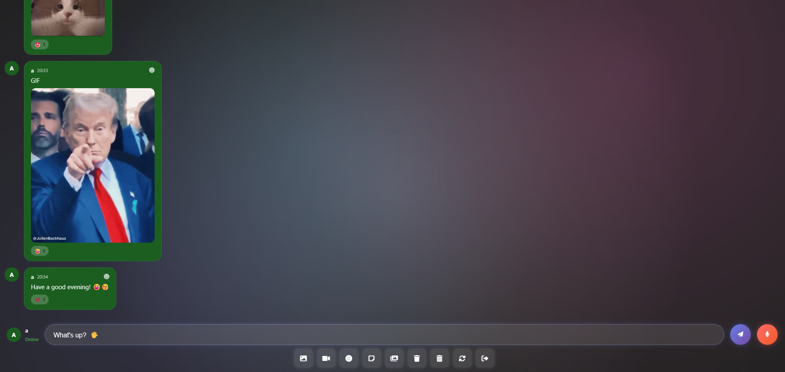

# Universal Chat Web App

This project is a front-end real-time general web chat where multiple users join one shared room.

It uses Firebase Authentication + Firestore and can be hosted on any static web host.

## Features

- Real-time shared room chat
- Email/password authentication
- Text messages, emojis, GIFs, stickers, images, videos, and voice messages
- Emoji reactions
- Auto-scroll and anti-spam protection (text/GIF/sticker)
- Responsive design with mobile-friendly layout

## Demo



## Tech Stack

- HTML, CSS, JavaScript (vanilla)
- Firebase Authentication
- Firebase Firestore
- Optional GIPHY API integration

## Setup (Step-by-Step)

### 1) Create Firebase project

1. Go to [Firebase Console](https://console.firebase.google.com/).
2. Create a new project.
3. In your project, create a **Web App** and copy its config values.

### 2) Enable Firebase services

1. **Authentication** -> **Sign-in method** -> enable **Email/Password**.
2. **Firestore Database** -> create database (start in test mode for local testing, then lock rules before production).

### 3) Configure this web app

1. Open `index.html`.
2. Replace `firebaseConfig` placeholder values (`YOUR_API_KEY`, etc.) with your own Firebase app config.
3. Ensure the `<script type="module">` initialization in `index.html` remains intact.

### 4) (Optional) Configure GIPHY

GIF search/trending requires a GIPHY key.

- Set `window.GIPHY_API_KEY` in `index.html`, or
- Replace `YOUR_GIPHY_API_KEY` in `script.js` with your actual key.

Without a valid key, GIF search/trending will show an error; stickers still work from predefined URLs.

## Run Locally

Serve as static files, for example:

```bash
# Python
python -m http.server 8080

# Node.js
npx serve . -l 8080
```

Then open [http://localhost:8080](http://localhost:8080) (if using a server).

Alternatively, you can simply open the `index.html` file path directly in your browser.


## Deploy

Because this is a static client webpage, you can upload it to any web server:

- Shared hosting (cPanel)
- Nginx / Apache
- GitHub Pages
- Netlify / Vercel / Firebase Hosting

Required files:

- `index.html`
- `styles.css`
- `script.js`

## How to Use

1. Open the webpage URL.
2. Create account or login.
3. Send text or media from the input toolbar.
4. Open the same URL from other users/devices to chat in the same room.

## Known Limitations

- Single global room: all users share one `messages` collection.
- Media is stored inline in Firestore docs (base64), so strict upload limits are enforced to avoid Firestore size failures.
- “Clear all messages for this session” is local-only and hides older messages in your own view (uses local state, does not delete Firestore documents).
- “Clear all messages permanently” deletes all messages in your own view forever; you will not see them again even after refreshing the page (uses local storage, does not delete Firestore documents).
- GIF trending/search requires a valid GIPHY key and internet access.

## Security Notes

- This webpage uses one general shared room (global message collection).
- Configure Firestore rules before production release.
- Keep Firebase usage quotas/limits in mind for public deployments.
- For production scale, store media in Firebase Storage and save only URLs in Firestore.

## Support Me

If you're a happy user of `github.com/alexpreli`, I would really appreciate your support to help me keep updating and developing more tools 💛

You can support me using the Ko-fi and PayPal links.

<div>
  <a href="https://ko-fi.com/preli">
    
  </a>
</div>

<div>
  <a href="https://paypal.me/preli7">
    
  </a>
</div>

## Patreon Page

If you are interested in more apps or utilities, you can check out my patreon page.

[](https://patreon.com/Tigerzeria)


Thanks for visiting my profile and checking out my projects.
